# 0. Probability is not intuitive for humans

The human brain is not wired to understand probabilities intuitively. In the following examples, we see that most people will think the answer to these questions is easy and intuitive, but what our gut is telling us to be the right answer, it is actually wrong!

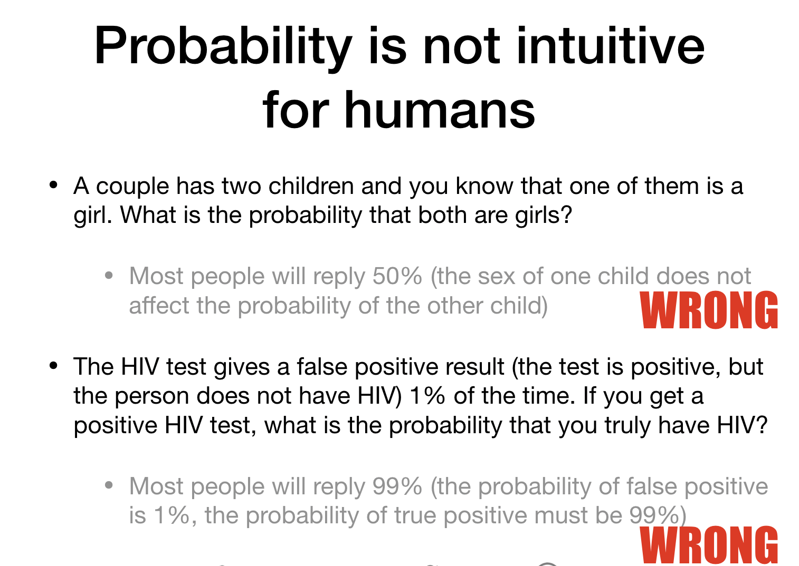

One example is particularly interesting as it concerns many PhDs (some in Math) being adamantly wrong about a probability. This is the famous Monty Hall problem: there are three doors, behind one door there is a car and the other two doors have goats. The participant is asked to choose one door, and then, the host of the show will open a door with a goat. The participant will be asked if they want to change doors. 

The _Ask Marylin_ column replied that the strategy to maximize the probability of winning was to switch doors, but people were not happy with her answer (Source: Mlodinow, 2008).

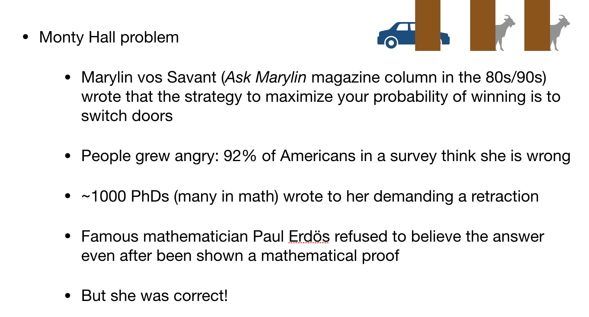

## Key take-away points

- You are not bad at probability, we all are!
- When it comes to probabilities, we do not trust our gut, we trust the formulas

# 1. What is probability?

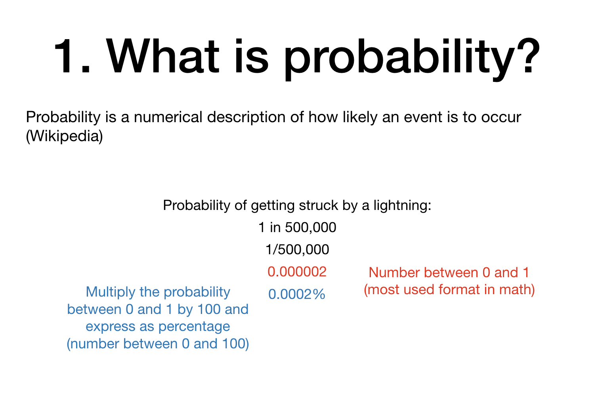

We can write probabilities in many different formats. Using a number between 0 and 1 is the most common format used in mathematics, but we can also represent this number as a percentage.

**Why do we care about probabilities in forensic science?**
Many times we are interested in a very specific probability: _What is the probability that a randomly selected individual will have a DNA profile that matches the DNA profile from the evidence sample?_

If this probability is high, then maybe we are not impressed that our suspect matches the evidence DNA profile.
If it is low, then we are very impressed that our suspect matches the evidence DNA profile.

----------

Let's start with a simpler probability: _What is the probability that a randomly selected individual will be a dog lover?_

If we have access to the preferences of the whole population (represented below, imagine that it is a population with 45 individuals in total), we can count how many individuals are dog lovers (in this case, 21) and then compute the probability as 21/45 = 0.467.

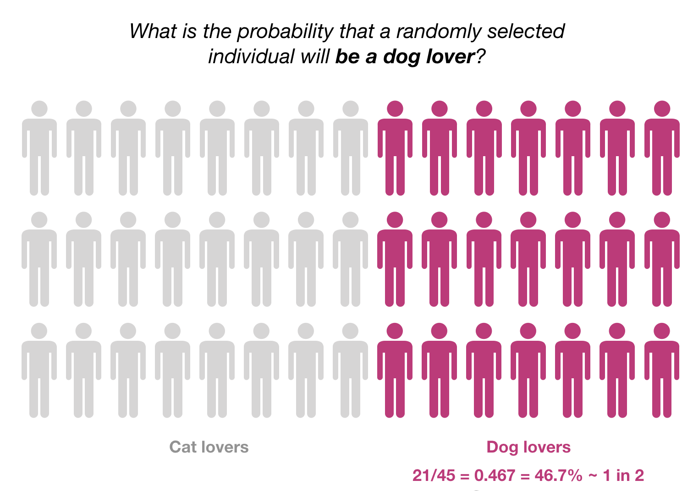

One immediate question when we are calculating this probability should be: _which population are we using to calculate this probability?_

Because different populations can have different proportions of dog lovers:

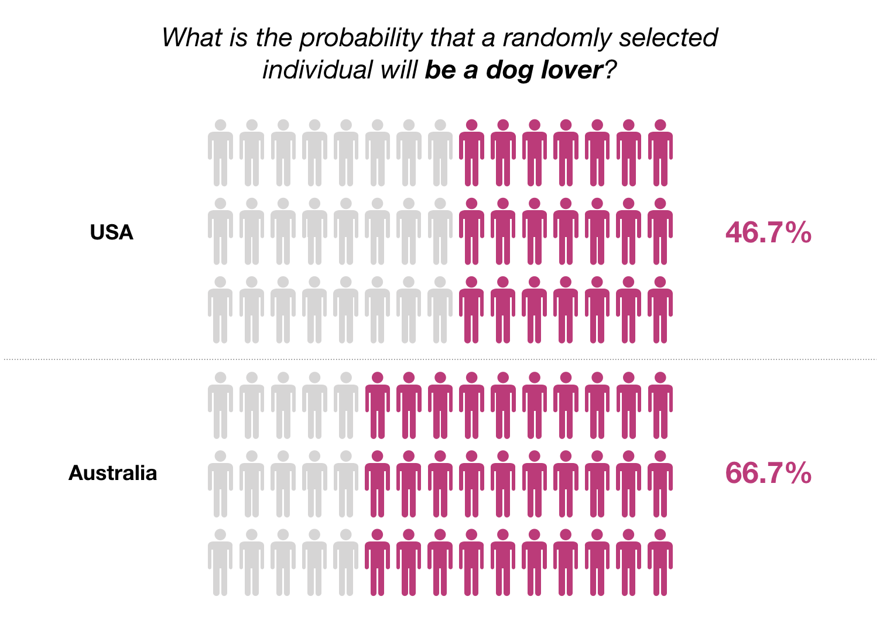

Let's make our question more precise then: _What is the probability that a randomly selected individual in the US will be a dog lover?_

Most of the times, we do not have access to the information from the whole population. So, we need to select a subset of the population to calculate our probability. This subset of the population is denoted "a sample":

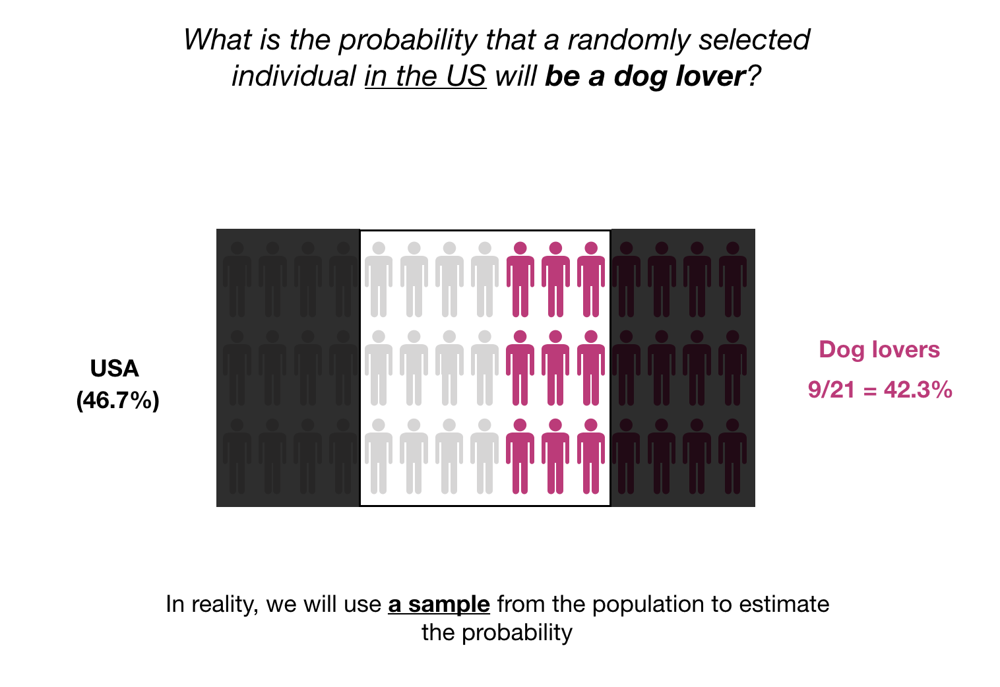

Selecting a "good" sample is crucial when computing these probability. A "good" sample has to be a representative sample. This means that the proportions of the population as a whole are well represented in the sample.

In this case, our sample looks ok as we have a sample probability of 42.3% compared to the population probability of 46.7% (not far).

However, different samples will yield different probabilities:

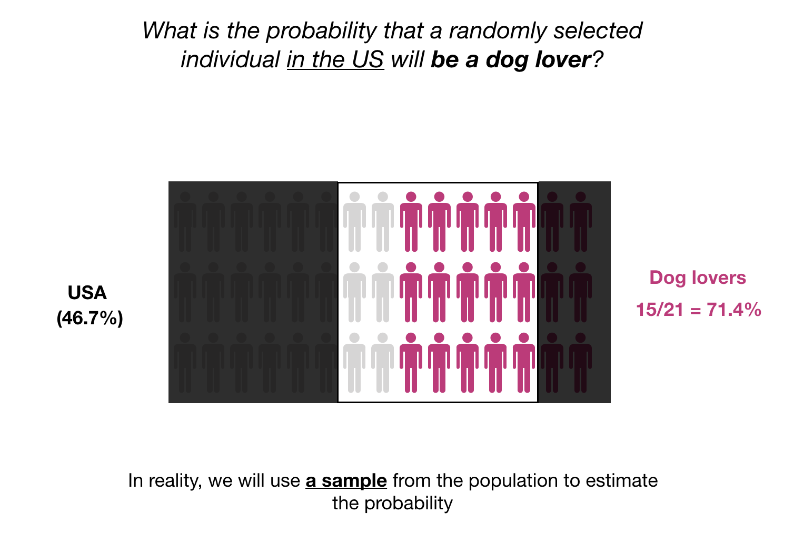

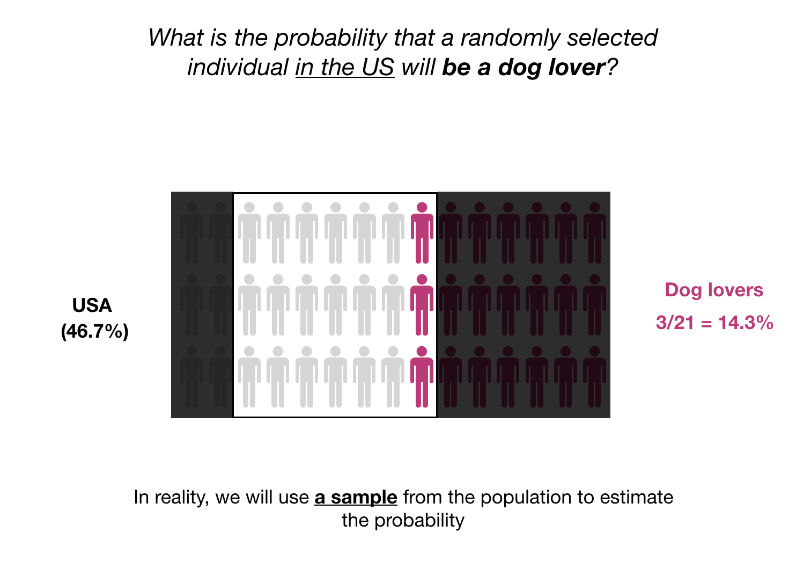

Not only the preserved proportions are important, but also the sample size. Smaller samples will provide less accurate estimates for the desired probability:

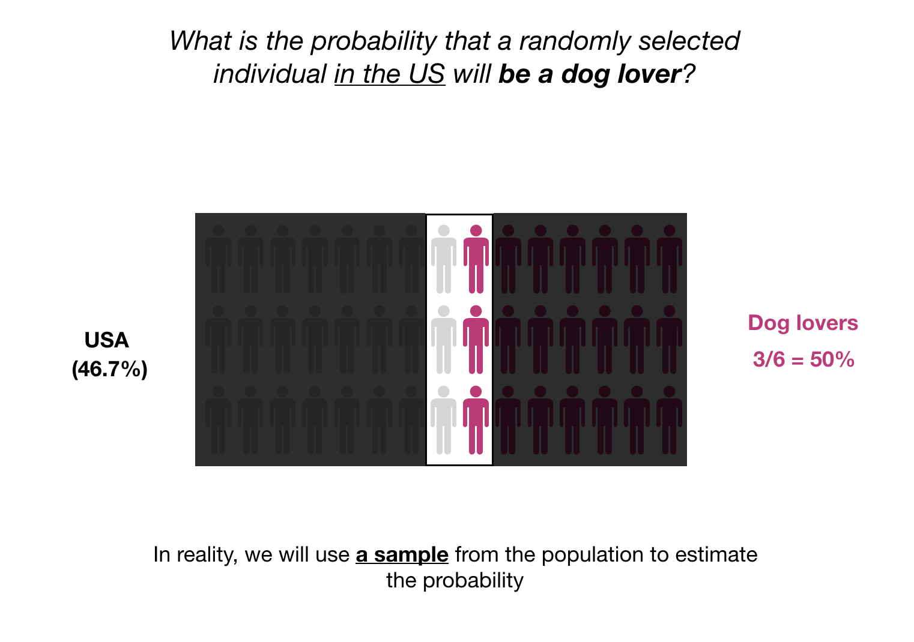

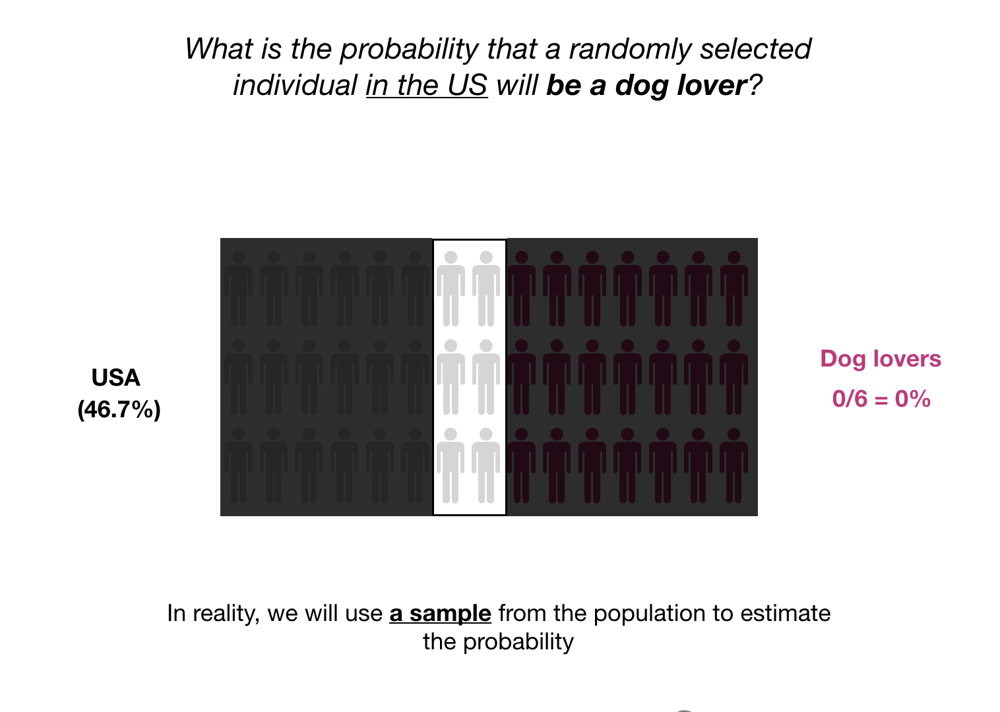

**Back to forensics:** 
We are not interested to calculate the probability that someone is a dog lover, we are interested in the probability that someone's DNA has a specific allele. But the question can be framed in the same manner as the cat/dog lover, only that instead of counting how many people in the population (or sample) are dog lovers, we count how many people in the population (or sample) have a certain allele.

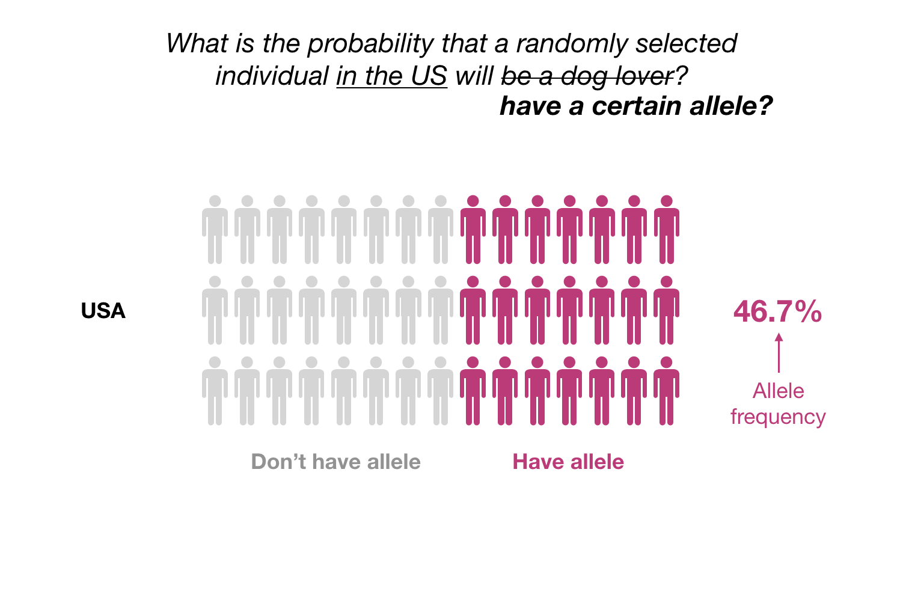

## Key take-away points

- We estimate population probabilities from observed frequencies in samples
- We always want to ask:
    - Where did the sample come from?
    - Is it representative of the population?
    - How large is the sample?