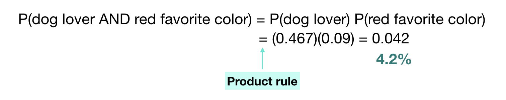
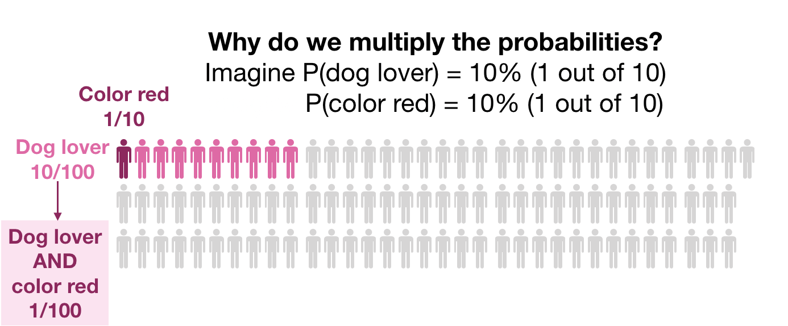
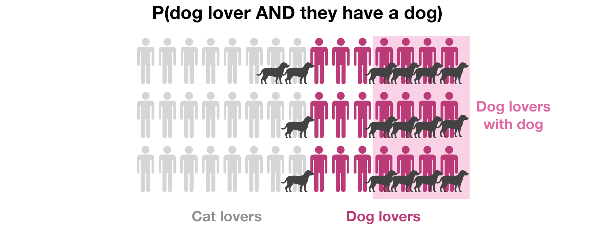
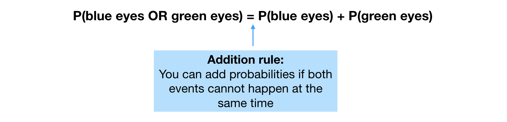
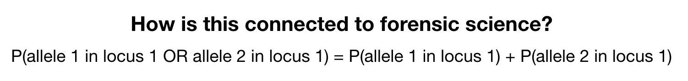
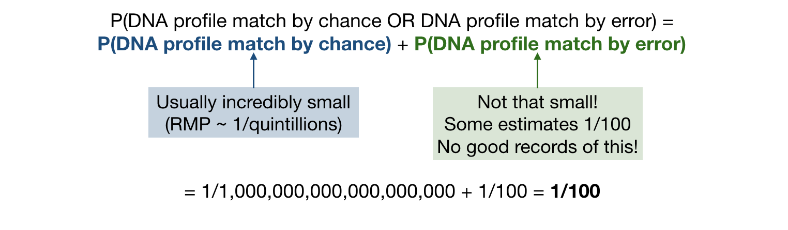

# 2. How do we combine probabilities?

## The product rule

Imagine that you want the probability of a dog lover because you are on a dating app and want to meet a dog lover.
Imagine that you are very picky and also want to meet someone whose favorite color is red. We want then to combine two probabilities: the probability that someone is a dog lover and the probability that someone prefers the color red.

Thus, we want the probability that someone is a dog lover AND that their favorite color is red.

We use the **product rule** in this case to calculate the probability that someone is a dog lover AND that their favorite color is red as the product of the two probabilities. Imagine that someone already calculated the probability of having red as favorite color as 9%. Then, by the product rule, the probability that someone is a dog lover AND that their favorite color is red is 0.042 or 4.2%.

Why do we multiply probabilities? Because the set of candidates that satisfy both conditions gets smaller and smaller:

The main thing to keep in mind is that the produce rule does not apply in any scenario. The product rule is only valid when the two events are **independent**.

Two events are independent if knowing one is true does not provide any information about the other. For example, knowing that someone is a dog lover does not provide any information about their favorite color, so we can safely multiply the two probabilities assuming the two events are independent.

One example of two events that are not independent is the following: _What is the probability that someone is a dog lover AND that they have a dog?_

In this case, the first event (being a dog lover) does make the second event (having a dog) more likely. This was not the case with the favorite color example (being a dog lover does not make it more likely that your favorite color is red).

Thus, we cannot use the product rule to calculate the probability that someone is a dog lover AND that they have a dog. The product rule is a shortcut. When we cannot use it, we need to rely on our good old _observed frequency in a sample_. 

**How is this connected to forensic science?**
In forensic science, we want to calculate the probability that a randomly chosen individual has allele 1 in locus 1 AND allele 2 in locus 2. Under the assumption of indepentent loci, we can use the product rule to multiply the probabilities. This concept is crucial when studying Random Match Probability (RMP).

## The addition rule

Imagine that you are not that picky and would be equally happy with a dog lover or with someone whose favorite color is red.

Note that we need to subtract the probability that someone is a dog lover AND has red as favorite color. The reason for that is that when we compute the probability of being a dog lover, we include in this count every dog lover _regardless_ their favorite color. That is, we count dog lovers whose favorite color is red. When we then count the probability of red as favorite color, we also count people _regardless_ of whether they are cat or dog lovers. And thus, we count again the people whose favorite color is red and that are dog lovers. Thus, we end up counting twice the people that are dog lovers whose favorite color is red (once when we count the dog lovers, and twice when we count the people with favorite color red). So, we need to subtract them at the end.

There are times when the intersection of two events is empty. For example, if I want to calculate the probability that someone has blue eyes OR green eyes. While there could be a tiny proportion of the population with one blue eye and one green eye, this proportion is so small that we can ignore it and consider the two events (blue eyes OR green eyes) to be disjoint. 

For these types of events, the addition rule simply mean that we add up the probabilities of the two events (no need to subtract anything):

For mixed samples: an individual would have allele 1 or allele 2 (assume they cannot have both at the same time) so we add the probabilities. This is a crucial concept when studying Combined Probability of Inclusion (CPI).

Another place in forensic science where the addition rule appear is when considering that a DNA match could be due to lab error:

Even if the probability of a DNA match by chance is minuscule, the probability of DNA match by error will be larger (say, 1/100). If we assume both events cannot happen at the same time, then the probability of DNA match by chance OR by lab error would be the sum of the two probabilities by the addition rule. Minuscule number plus 1/100 is still 1/100 which is not negligible.

## Key take-away points

- Product rule: we can calculate the probability of simultaneous events when they are independent
- Addition rule: we can calculate the probability of different disjoint events
- Key questions to ask:
    - When multiplying probabilities, are events really independent?
    - When adding probabilities, is it impossible for both events to happen at the same time?
