# 3. Updating probabilities when new information is available

## Conditional probabilities

Imagine that you are watching photos in the dating app and you see a person you like with a dog.
What is the probability that a person is a dog lover _given that_ they have a photo of a dog?

We use a vertical line `|` to divide the event of interest (someone is a dog lover) from the _conditioning event_ that we now know (they have a photo of a dog).

When we have this new information (the person has a photo of a dog in their profile), we reduce the population to only focus on people that have a photo of a dog in their profile. So, instead of counting the number of dog lover over the whole population, we only count the number of dog lover among those that have a photo of a dog in their profile (15 people). Out of the 15 people with a photo of a dog in their profile, 12 of them are dog lovers. So the updated probability `P(dog lover | photo of dog)` is 12/15 = 80%.

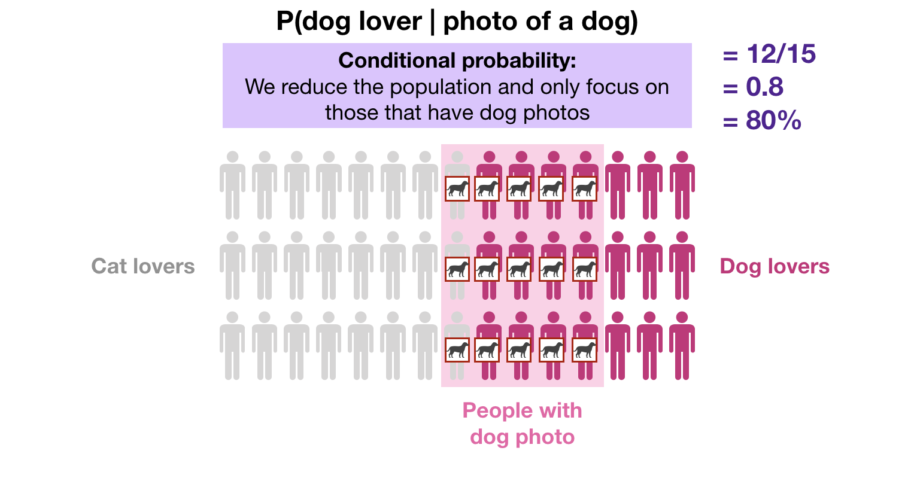

At this moment, we should distinguish that the probability that someone is a dog lover GIVEN THAT they have a photo of a dog in their profile (conditional probability) is not the same as the probability that someone is a dog lover AND has a photo of a dog in their profile (simultaneous events).

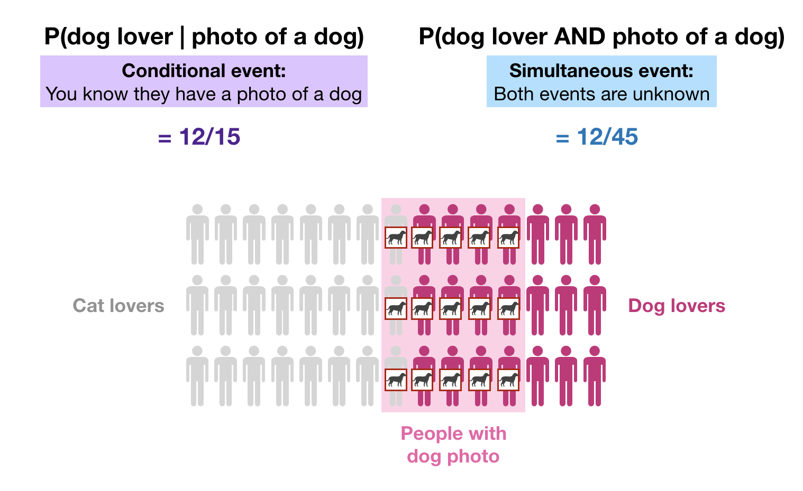

When we want the probability of simultaneous events, both events are unknown. However, when we want the probability of one event conditioned on the other event, then the conditioning event is known to be true.

We can obtained the conditional probability `P(A|B)` by dividing `P(A and B)` by `P(B)`:

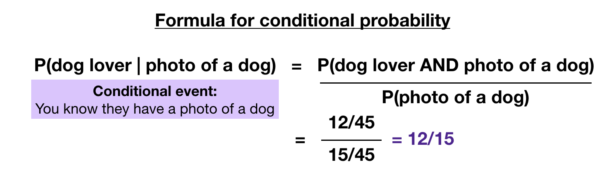

So, overall, we have two ways to calculate a conditional probability:

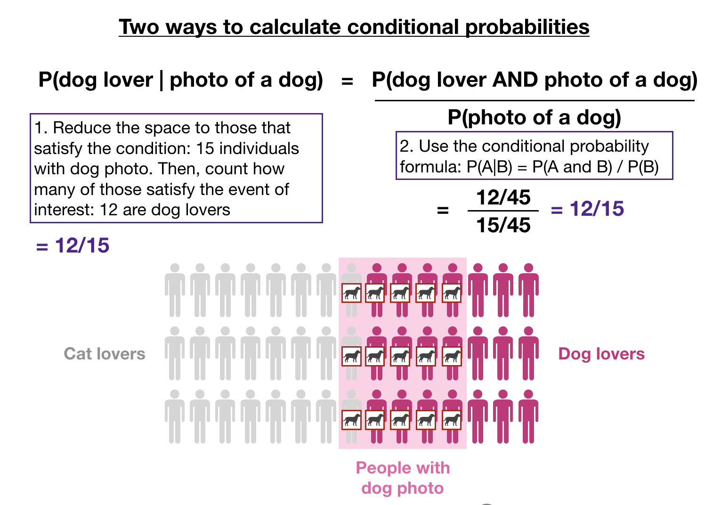

Let's review the concept of conditional probability in some examples.

### Conditional probability of having two girls given one girl

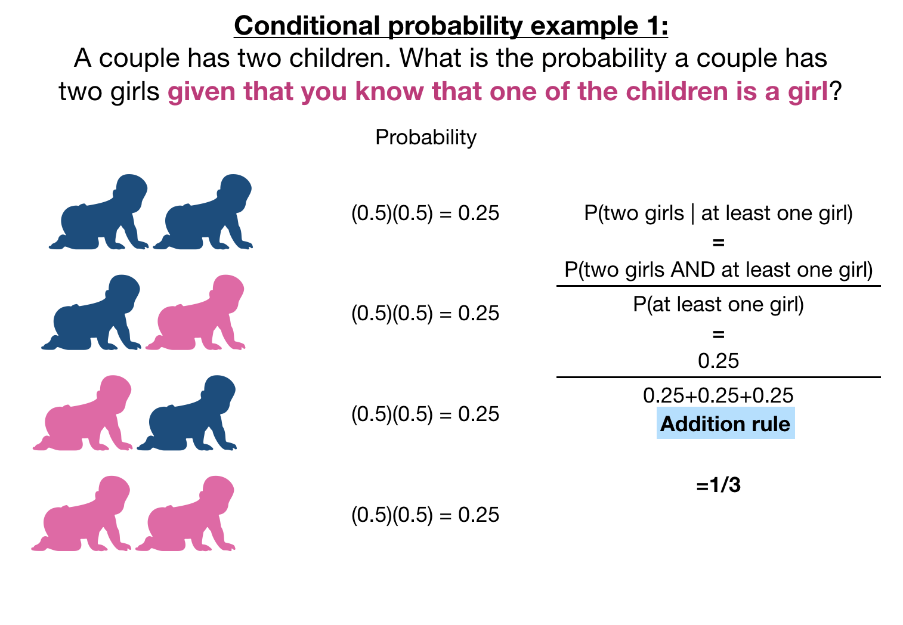

Remember that in our first topic we saw that our gut thinks that this probability should be 50%. It is not. The correct probability is 1/3 or 33.3%.

### Conditional probability of being healthy given a positive test

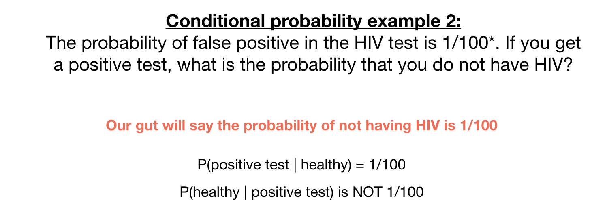

It is very common to confuse the conditional probability. In this case, we know that the probability of having a positive test given that you are healthy is 1/100. We do not want this probability. We want the inverse: the probability that I am healthy given that I had a positive test. This is not 1/100! (Note that we are using made-up numbers).

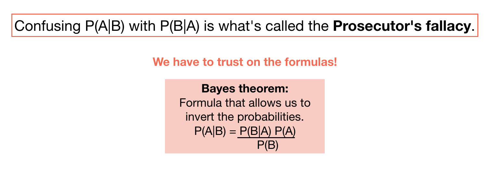

When we want `P(A|B)` but we have `P(B|A)`, we have to use Bayes theorem.
So, back to our example:

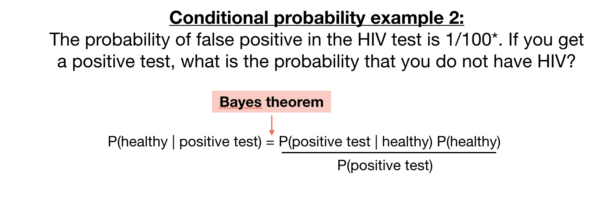

Note that we need other probabilities:
- `P(healthy)`
- `P(positive test)`

People are sometimes confused that we need the probability of being healthy to calculate the probability of being healthy given a positive test. It feels like a circular argument. But recall that the conditional probability is what we use when we want to _update a probability given new information_. So, we should already have a `P(healthy)` and we want to update this probability with the new information (getting a positive test).

_Where do we get this probability?_ It will depend on the disease prevalence and your risk group.

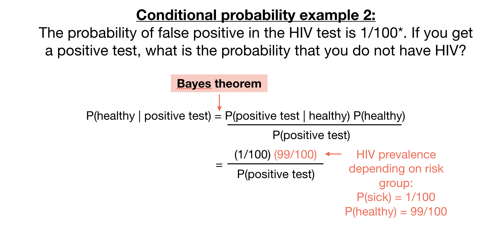

On the other side, we need the probability of getting a positive test for any person (sick or healthy). Usually, we only have the conditional probabilities for these types of tests: 
- the probability of getting a positive test when you are sick `P(positive test | sick)` which is denoted the _sensitivity of a test_
- the probability of getting a positive test when you are healthy `P(positive test | healthy)` which is denoted the _false positive rate_

To calculate the probability of getting a positive test `P(positive test)` when we only have the conditional probabilities `P(positive test | sick)` and `P(positive test | healthy)`, we use the Law of Total Probability:

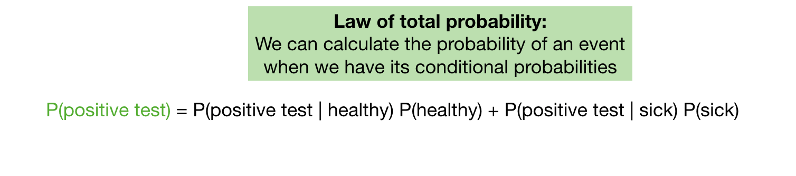

Putting it all together, we get

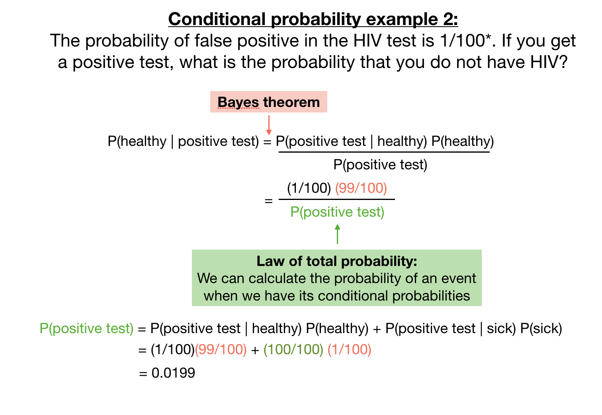

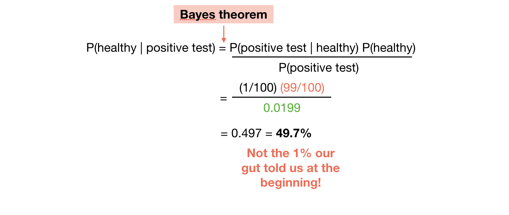

### Conditional probability of being sick given a negative test

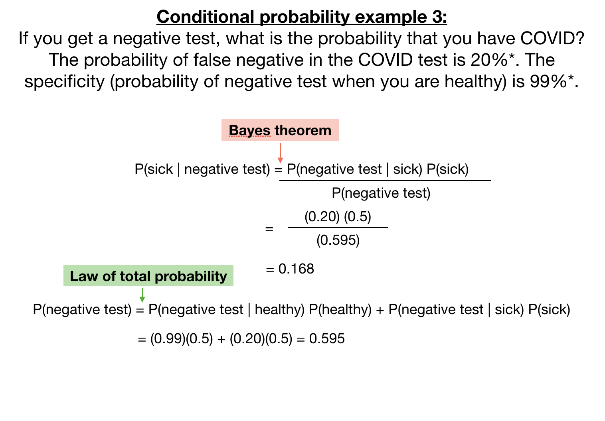

Note that here we are assuming a 50% probability of being sice `P(sick)`. This is equivalent to not having any information so it is like a coin toss. (Also note that these are also made-up numbers).

Your probability of being sick `P(sick)` could be actually different if you have a high suspicion you could have COVID.

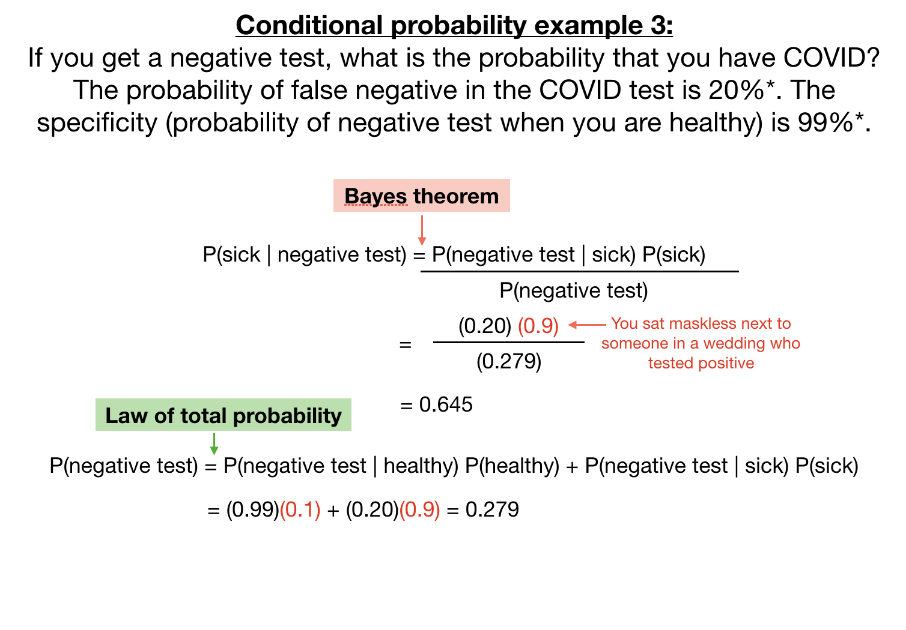

The conditional probability changed dramatically from 17% when the probability of being sick was a coin toss (50%) to 65% when there is high suspicion that you might have COVID. This example shows that the new information (negative test) does not carry all the weight. Other information that goes into `P(sick)` is just as important, especially in forensic science.

**In forensics,** we want the conditional probability that someone is guilty given that the DNA matched `P(guilty|DNA match)`, but for this probability, we need to have the probability of being guilty in the first place `P(guilty)` which needs to come from other evidence.

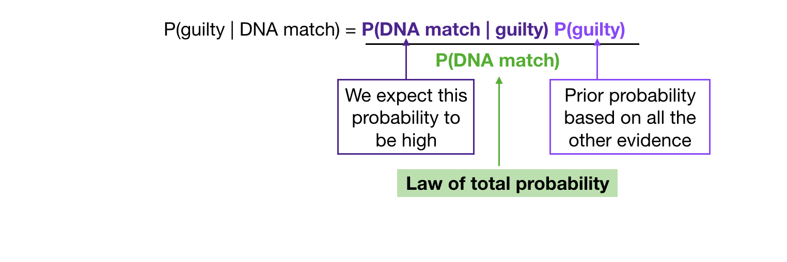

## Prosecutor's fallacies

1. `P(guilty|evidence)` is not the same as `P(evidence|guilty)`

2. Conditioning on the wrong event: _A battered woman was murdered and her husband is on trial. The defense lawyer presents the following statistics: out of 100,000 battered women in the US, only 40 were murdered by their partner, therefore, the probability that the husband is guilty is 40/100000. Is this the right probability?What is the probability we really want? You also have the following statistics: Of a set of 100,000 battered women, 45 were murdered and 99,955 were not murdered. Out of the 45 murdered women, 40 were murdered by their partner and 5 were murder by someone else._

We are not really interested in the probability of getting murdered by their partner given that they are battered. We know the woman had been murdered. We really want the probability of getting murdered by their partner given that they had been murdered. It is a different conditioning event!

3. Multiple testing: _The probability that two DNA profiles match by chance has been calculated at 1/10000 (made-up number). A database of 20,000 men is searched and one match is found. How confident do you feel with the match?_

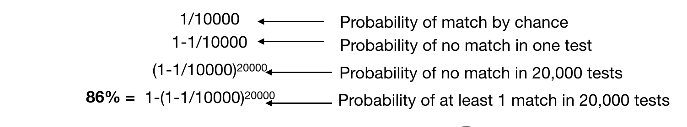

Even when the probability that two profiles will match by chance is small (1/10000), the fact that we are doing this test 20,000 times results in a probability of 86% of finding at least one match.

## Last exercise: let's put our probability muscles to the test

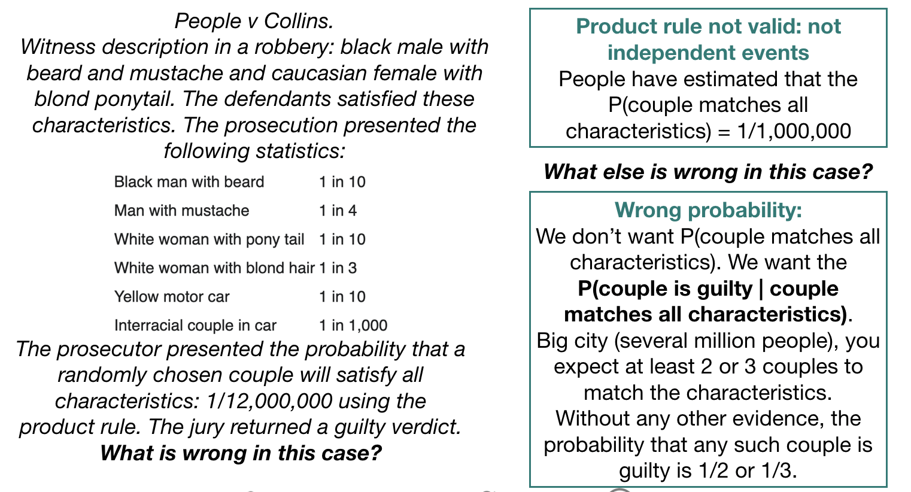

## Key take-away points
- Do not confuse `P(A|B)` with `P(B|A)`
- When computing `P(A|B)`, the prior probability `P(A)` also matters
- Always ask: is this the probability that I want?